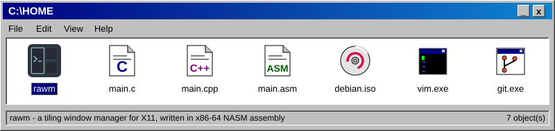

<i>Click the window to visit rawm!</i>

<a href="https://github.com/lispovckiy">My GitHub</a> |
<a href="https://github.com/lispovckiy?tab=repositories">All my repositories</a> |
<a href="https://github.com/lispovckiy/rawm">rawm</a>

<table>
<tr>
<td></td>
<td></td>
</tr>
</table>

Copyright (c) 1996-2026 lispovckiy. All rights stoled. *stolex *stoleg *stolen  
This page is best viewed at 800x600 in 256 colors.

