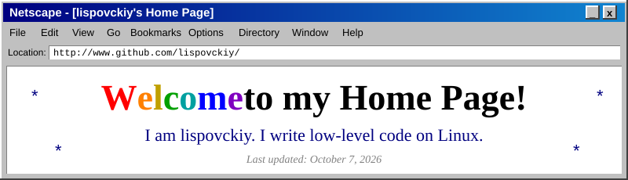
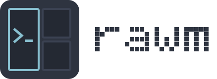

 

<h2><u>About me</u></h2>

Hello and welcome! 
My name is <b>lispovckiy</b>. 
I write programs in <b>C</b>, <b>C++</b> and <b>x86-64 assembly</b>. 
I run <b>Debian</b> and edit everything in <b>Vim</b>.

<h2><u>My Projects</u></h2>

<table>
<tr>
<td align="center">
<picture>
  <source media="(prefers-color-scheme: dark)" srcset="logo.svg">
  
</picture>
  
<a href="https://github.com/lispovckiy/rawm"><b>rawm</b></a> 
A tiling window manager for X11 written in x86-64 NASM assembly. 
<i>Click the picture to visit the project page!</i>
</td>
</tr>
</table>

<h2><u>My Computer</u></h2>

<h2><u>Links</u></h2>

<a href="https://github.com/lispovckiy">My GitHub</a> |
<a href="https://github.com/lispovckiy?tab=repositories">All my repositories</a> |
<a href="https://github.com/lispovckiy/rawm">rawm</a>

  

  

  

Copyright (c) 1996-2026 lispovckiy. All rights reserved. 
This page is best viewed at 800x600 in 256 colors.

